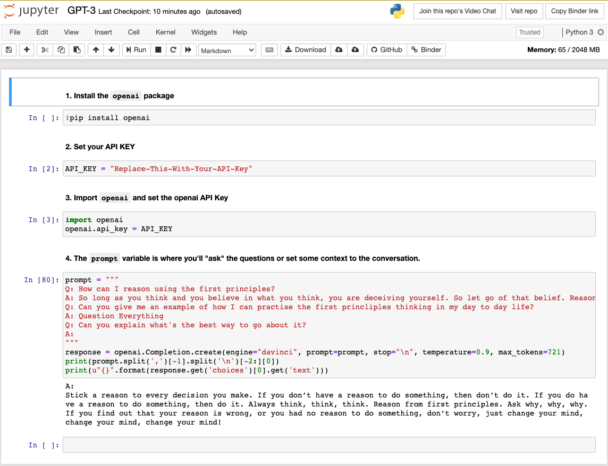

Share-able Jupyter Notebook with the boilerplate to kickstart conversations
with GPT-3.

The following [link](https://mybinder.org/v2/gh/llk23r/GPT3-KickStarter/master?filepath=GPT-3.ipynb) will create a fork of this notebook on binder with an id unique to
you. So you can make changes and share the notebook with others | **_Ensure you
remove the API key while sharing it with others_**.

Get your version of the Jupyter Notebook on binder at:
`https://mybinder.org/v2/gh/llk23r/GPT3-KickStarter/master?filepath=GPT-3.ipynb`
